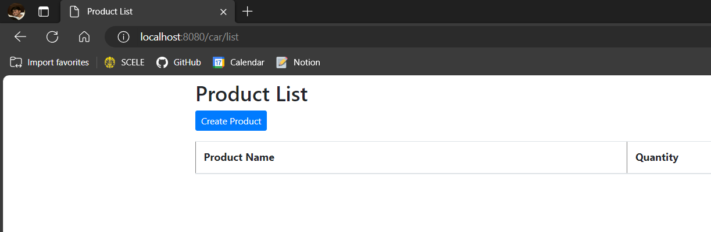

# Pemrograman Lanjut A
> Tegar Wahyu Khisbulloh - 2206082032

App Link: https://eshop-tegar-wahyu.koyeb.app/
<details>
<summary> Module 1 </summary>

## Module 1 - Coding Standards
### Reflection 1
You already implemented two new features using Spring Boot. Check again your source code and evaluate the coding standards that you have learned in this module. Write clean code principles and secure coding practices that have been applied to your code.  If you find any mistake in your source code, please explain how to improve your code. Please write your reflection inside the repository's README.md file.

Pada saat menambahkan fitur baru menggunakan Spring Boot, saya telah menerapkan beberapa prinsip _clean code_ dan _secure coding practices_ yang telah saya pelajari pada modul ini. Beberapa contohnya adalah:
1. Memberikan nama yang jelas dan deskriptif pada variabel, method, dan class yang saya buat. Hal ini bertujuan agar orang lain yang membaca kode saya dapat dengan mudah memahami maksud dari kode tersebut.
2. Memecah kode menjadi beberapa fungsi yang kecil dan berfokus pada satu tugas seperti findById, edit, delete, dst. Hal ini bertujuan agar kode lebih mudah dibaca dan dimengerti.
3. Menggunakan format yang konsisten pada kode saya, seperti penamaan variabel, penulisan method, dan lain-lain.

Namun, saya menyadari bahwa masih ada beberapa hal yang perlu diperbaiki pada kode saya. Contohnya saya hanya melakukan validasi input agar tidak negatif, mungkin selanjutnya bisa ditambahkan validasi lainnya agar lebih aman.

### Reflection 2
1. Menurut saya, tidak ada batasan pasti mengenai berapa banyak unit test yang harus dibuat dalam satu class. Namun, setidaknya kita harus membuat unit test untuk setiap method yang ada pada class tersebut. Untuk memastikan bahwa unit test yang kita buat sudah cukup untuk memverifikasi program kita, kita bisa menggunakan _code coverage_. Code coverage adalah suatu parameter yang dapat membantu kita memahami seberapa banyak kode yang sudah diuji. Namun, memiliki code coverage 100% tidak menjamin bahwa kode kita tidak memiliki bug atau error. Code coverage hanya memberikan informasi seberapa banyak kode yang sudah dicover/diuji, bukan seberapa baik kode tersebut.
2. Membuat functional test suite yang baru dengan setup procedures dan instance variables yang sama dengan functional test suite sebelumnya akan membuat kode menjadi kurang bersih. Hal ini dikarenakan kode yang kita buat akan menjadi duplikat. Duplikasi kode akan membuat kode kita menjadi sulit untuk dimaintenance dan diperbaiki. Selain itu, jika kita ingin menambahkan atau mengubah sesuatu pada kode, kita harus mengubah di semua tempat yang sama, yang tentunya akan memakan waktu dan tenaga.
</details>

<details>
<summary> Module 2 </summary>

## Module 2 - CI/CD & DevOps
### Reflection


#### 1. List the code quality issue(s) that you fixed during the exercise and explain your strategy on fixing them. (minimum 3 sentences)

Setelah melakukan analisis menggunakan SonarCloud, saya menemukan beberapa issue pada kode saya. Beberapa issue tersebut adalah:
- **Issue: Remove Unnecessary public modifier.**
   ```java
  import static org.mockito.Mockito.*;
    
  @ExtendWith(MockitoExtension.class)
  public class ProductServiceImplTest {
  @Mock
  ProductRepository productRepository;
   ...
  ```
- **Solusi:**
  ```java
   import static org.mockito.Mockito.*;
    
   @ExtendWith(MockitoExtension.class)
   class ProductServiceImplTest {
   @Mock
   ProductRepository productRepository;
  ...
   ```
  Saya menghapus public modifier pada class ProductServiceImplTest karena class tersebut hanya digunakan untuk testing dan tidak perlu diakses dari luar class.
- **Issue: Remove this unused import on HomePageController.java**
   ```java
  package id.ac.ui.cs.advprog.eshop.controller;
    
  import id.ac.ui.cs.advprog.eshop.model.Product;
  import id.ac.ui.cs.advprog.eshop.service.ProductService;
  import org.springframework.beans.factory.annotation.Autowired;
  import org.springframework.stereotype.Controller;
  import org.springframework.ui.Model;
  import org.springframework.web.bind.annotation.*;
    
  import java.util.List;
    
    
  @Controller
  @RequestMapping ("/")
  public class HomePageController {
  ...
  ```
- **Solusi:**
   ```java
  package id.ac.ui.cs.advprog.eshop.controller;

  @Controller
  @RequestMapping ("/")
  public class HomePageController {
  ...
  ```
  Saya menghapus import yang tidak digunakan pada class HomePageController agar kode saya lebih bersih dan mudah dibaca.
- **Issue: Remove unnecessary public modifier on CreateProductFunctionalTest.java**
   ```java
  ...
    @SpringBootTest(webEnvironment = RANDOM_PORT)
    @ExtendWith(SeleniumJupiter.class)
    public class CreateProductFunctionalTest {
    @LocalServerPort
    private int serverPort;
  ...
  ```
- **Solusi:**
   ```java
  ...
    @SpringBootTest(webEnvironment = RANDOM_PORT)
    @ExtendWith(SeleniumJupiter.class)
    class CreateProductFunctionalTest {
    @LocalServerPort
    private int serverPort;
  ...
  ```
  Saya menghapus public modifier pada class CreateProductFunctionalTest karena class tersebut hanya digunakan untuk testing dan tidak perlu diakses dari luar class.
2. Look at your CI/CD workflows (GitHub)/pipelines (GitLab). Do you think the current implementation has met the definition of Continuous Integration and Continuous Deployment? Explain the reasons (minimum 3 sentences)!

   Menurut saya, implementasi CI/CD yang saya buat sudah memenuhi definisi CI/CD. Implementasi CI yaitu pada GitHub Actions akan menjalankan workflows `sonarcloud.yml`, `ci.yml`, dan `scorecard.yml`. Selain itu, saya juga sudah membuat pipeline yang akan melakukan deploy otomatis ke Koyeb setiap kali saya melakukan push ke repository. Hal ini sudah memenuhi definisi CD.
</details>

<details>
<summary> Module 3 </summary>

## Module 3 - Maintainability & OO Principles
### Reflection

#### Explain what principles you apply to your project!
1. **Single Responsibility Principle (SRP)**
    - Saya mengimplementasikan prinsip SRP pada codebase saya dengan memisahkan fungsi-fungsi yang berbeda ke dalam class yang berbeda.
    - Contoh dari implementasi SRP yang saya lakukan yaitu memisahkan class `CarController` yang sebelumnya berada di dalam `ProductController` menjadi class tersendiri.
2. **Open/Closed Principle (OCP)**
    - Saya mengimplementasikan prinsip OCP pada codebase saya dengan mengubah kode pada `CarRepository.java` berikut:
    - Sebelum:
   ```java
    public Car update(String id, Car updatedCar) {
        for (int i = 0; i < carData.size(); i++) {
            Car car = carData.get(i);
            if (carId.getCarId().equals(id)) {
                car.setCarName(updatedCar.getCarName());
                car.setCarColor(updatedCar.getCarColor());
                car.setCarQuantity(updatedCar.getCarQuantity());
                return car;
            }
        }
        return null;
    }
   ```
    - Sesudah:
   ```java
    public Car update(String id, Car updatedCar) {
        for (int i = 0; i < carData.size(); i++) {
            String carId = carData.get(i).getCarId();
            String updatedCarId = updatedCar.getCarId();
            if (carId.equals(updatedCarId)) {
                carData.set(i, updatedCar);
                return updatedCar;
            }
        }
        return null;
    }
   ```
3. *Liskov Substitution Principle (LSP)*
    - Pada modul LSP dijelaskan sebagai berikut: "... subclasses must be replaceable with their base class without changing desired program properties, such as correctness and consistency.
      "
    - Pada codebase Saya, `CarController` adalah subclass dari `ProductController`. Akan tetapi, `CarController` tidak dapat diganti dengan `ProductController` karena memiliki fungsi yang berbeda. Sehingga Saya mengubah `CarController` menjadi class tersendiri.

4. *Dependency Inversion Principle (DIP)*
    - Saya mengimplementasikan prinsip DIP dengan mengubah kode pada `CarController.java` yang sebelumnya dependent langsung pada `CarServiceImpl.java` menjadi dependent pada `CarService.java` yang merupakan interface dari `CarServiceImpl.java`.

#### Explain the advantages of applying SOLID principles to your project with examples.
Keuntungan dari menerapkan SOLID principles dalam project saya adalah meningkatkan maintainability, readability, dan scalability codebase. Contohnya, dengan menerapkan SRP, setiap class memiliki tanggung jawab yang jelas dan terpisah, sehingga ketika ada perubahan hanya perlu dilakukan pada class yang bersangkutan tanpa memengaruhi class lain. Hal ini membuat debugging dan maintenance lebih efisien. OCP juga membantu project saya menjadi lebih fleksibel terhadap perubahan.

#### Explain the disadvantages of not applying SOLID principles to your project with examples.
Ketika SOLID principles tidak diterapkan, project dapat mengalami kesulitan dalam maintenance dan perubahan. Contohnya, jika tidak menerapkan SRP, satu class dapat memiliki tanggung jawab yang terlalu banyak, sehingga sulit untuk memahami, mengubah, atau menambahkan fitur baru.

Tanpa menerapkan OCP, setiap kali dilakukan perubahan pada suatu metode, bisa memaksa untuk mengubah kode yang sudah ada, berpotensi merusak fungsionalitas yang sudah berjalan.

Tidak menerapkan LSP juga dapat menyebabkan substitusi class yang tidak sesuai, menghasilkan bug dan ketidakpastian dalam perilaku class yang diharapkan. Contohnya pada `CarController` sebelumnya, jika masuk pada route /car/list, akan menampilkan list product padahal seharusnya tidak bisa ditampilkan dan list car hanya bisa diakses melalui route /car/listCar.


</details>